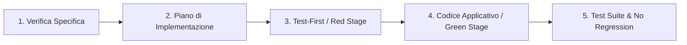

# 🤖 Agent Guidelines: Spec-Driven Development (SDD)

> **Regole e Vincoli di Sistema per Agenti AI**  
> *Progetto Didattico EasyLib — Ingegneria del Software (DISI, Università degli Studi di Trento)*

Queste istruzioni sono vincolanti per qualsiasi agente AI (Antigravity IDE, Cursor, Claude Code, GitHub Copilot) che opera su questo repository.

---

## 🎯 1. Principio Fondamentale: "No Spec, No Code"

1. **La Specifica è la *Single Source of Truth***:
   - Non generare o modificare codice applicativo senza che sia stata fornita o referenziata una specifica approvata (es. in `specs/*.md`, `SPEC_TEMPLATE.md` o `oas3.yaml`).
   - Se la richiesta dell'utente è ambigua, incompleta o non contiene criteri di accettazione chiari, **fai domande di chiarimento** o proponi di aggiornare la specifica prima di scrivere codice.

2. **Ruoli e Responsabilità**:
   - **Lo Studente/Utente**: è l'Architetto e il Revisore finale del sistema.
   - **L'Agente**: è un esecutore vincolato alle specifiche formali e alle suite di test.

---

## 🔄 2. Protocollo Operativo Obbligatorio in 5 Step

Ogni modifica al codice deve seguire rigidamente questa sequenza:

1. **Step 1 - Verifica Specifica**: Identificare i contratti API in `oas3.yaml`, i criteri di accettazione Gherkin e le invarianti di sicurezza.
2. **Step 2 - Proposta Piano (`implementation_plan.md`)**: Elencare chiaramente i file da creare, modificare o eliminare. Attendere l'approvazione umana prima di procedere.
3. **Step 3 - Test-First**: Scrivere o aggiornare i test automatici in `app/*.test.js` *prima* o contestualmente alla logica di business. I test devono coprire sia l'Happy Path che tutti gli edge case / errori documentati nella specifica.
4. **Step 4 - Implementazione Vincolata**: Scrivere solo il codice strettamente necessario per soddisfare i test e la specifica.
5. **Step 5 - Verifica Suite**: Eseguire `npm test` e verificare che tutti i test passino senza regressioni.

---

## 🛑 3. Vincoli Architetturali e Tecnologici Non Negoziabili

- **Stack Tecnologico**:
  - Backend: **Node.js 22+ (ES Modules obbligatori, `import/export`)**, **Express 5**, **Mongoose 8**, **JWT**.
  - Frontend: **Vue 3 (Composition/Options API)**, **Vite**, **Vue Router**.
  - Testing: **Jest**, **Supertest**, **Babel/VM Modules**.
- **Regole di Sicurezza**:
  - Mai salvare password in chiaro (usare hashing appropriato o delegare all'auth provider).
  - Tutte le rotte protette devono utilizzare il middleware `tokenChecker.js` e verificare `req.loggedUser`.
  - Non committare secret, credenziali o token hardcoded nei sorgenti.
- **REST & OpenAPI**:
  - Ogni nuovo endpoint o parametro deve essere formalizzato in [`oas3.yaml`](file:///Users/marcorobol/Develop/IS/EasyLib/oas3.yaml).
  - Usare codici di stato HTTP corretti: `200 OK`, `201 Created`, `204 No Content`, `400 Bad Request`, `401 Unauthorized`, `403 Forbidden`, `404 Not Found`, `409 Conflict`.
- **Dipendenze**:
  - Non installare librerie esterne non necessarie o non concordate senza esplicita richiesta dell'utente.

---

## 📋 4. Checklist di Auto-Verifica prima di Concludere il Task

Prima di segnalare il completamento di un task, l'agente deve verificare internamente:
- [ ] Il codice implementato rispetta ogni clausola della specifica di riferimento?
- [ ] `npm test` è stato eseguito e tutti i test sono passati?
- [ ] Il file `oas3.yaml` è stato aggiornato se sono stati modificati endpoint o DTO?
- [ ] Sono stati mantenuti commenti esplicativi e convenzioni di stile del progetto?
