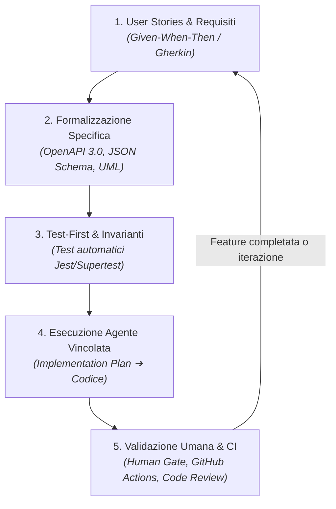
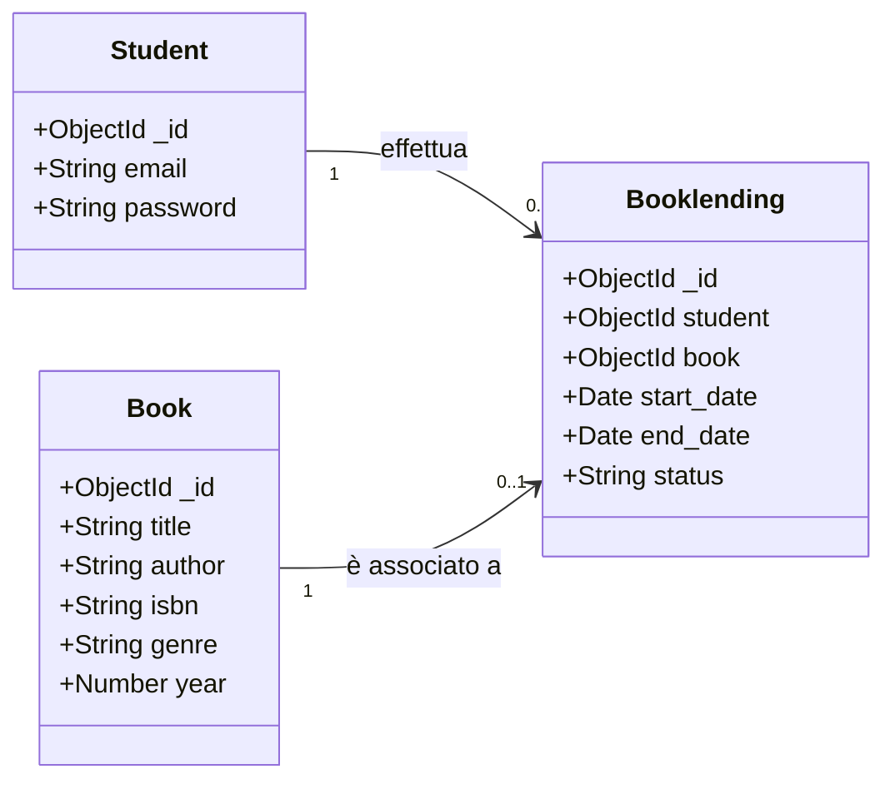
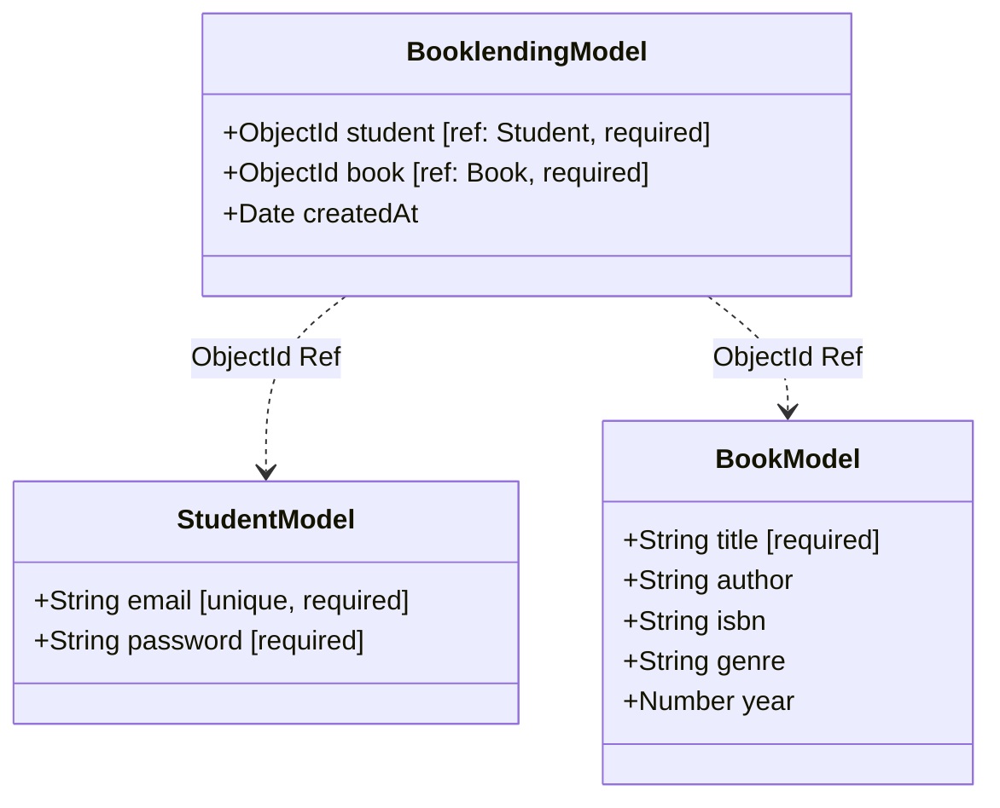
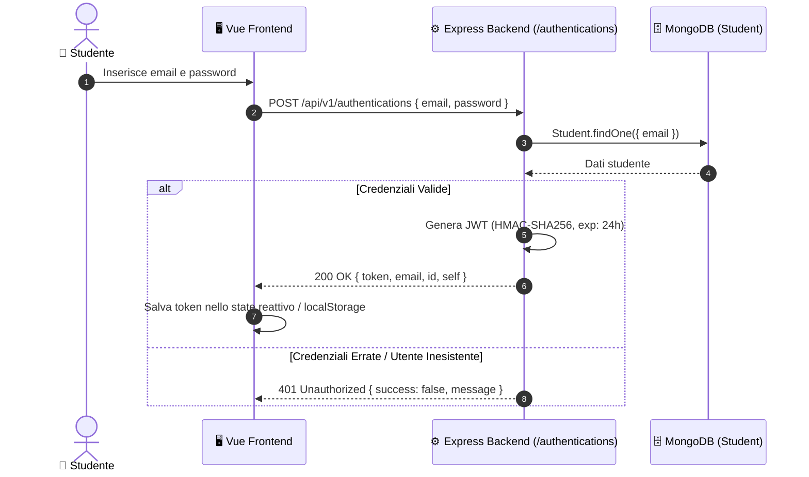
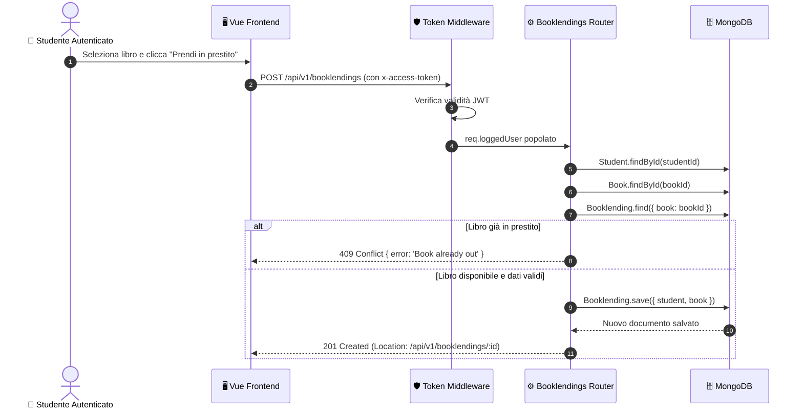

# 📚 EasyLib - Fullstack Library Management System

> **Progetto & Template Didattico per il corso di Ingegneria del Software**  
> *Dipartimento di Ingegneria e Scienza dell'Informazione (DISI) — Università degli Studi di Trento*

[](https://github.com/unitn-software-engineering/EasyLib/actions/workflows/node.js.yml)
[](https://opensource.org/licenses/ISC)
[](https://nodejs.org/)
[](http://localhost:8080/api-docs)

---

## 📑 Indice dei Contenuti

1. [📖 Panoramica del Progetto](#1--panoramica-del-progetto)
2. [🧠 Metodologia di Sviluppo: Spec-Driven Development (SDD)](#2--metodologia-di-sviluppo-spec-driven-development-sdd)
3. [📐 Architettura e Modelli UML](#3--architettura-e-modelli-uml)
4. [📋 Product Backlog & User Stories](#4--product-backlog--user-stories)
5. [🔄 Diario delle Iterazioni & Changelog (Sprint Logs)](#5--diario-delle-iterazioni--changelog-sprint-logs)
6. [🌿 Git Workflow & Convenzioni di Progetto](#6--git-workflow--convenzioni-di-progetto)
7. [🚀 Guida all'Installazione, Configurazione ed Esecuzione](#7--guida-allinstallazione-configurazione-ed-esecuzione)
8. [📚 Riferimenti & Risorse Utili](#8--riferimenti--risorse-utili)

---

## 1. 📖 Panoramica del Progetto

**EasyLib** è una piattaforma *fullstack* per la gestione integrata dei prestiti bibliotecari universitari. Il sistema consente agli studenti di consultare il catalogo dei libri, verificare la disponibilità delle copie in tempo reale e gestire i propri prestiti attivi, autenticandosi tramite credenziali locali o Google OAuth.

### 🏛️ Architettura di Sistema

Il progetto adotta un'architettura **Fullstack Monorepo**, suddivisa in:

- **Backend (`/app`)**: API RESTful stateless basata su **Node.js (ES Modules)** e **Express 5**, con persistenza su **MongoDB** tramite **Mongoose ODM**.
  - Autenticazione basata su **JSON Web Token (JWT)** e verifica Google OAuth (`google-auth-library`).
  - Documentazione automatica ed interattiva con **Swagger UI / OpenAPI 3.0** (`oas3.yaml`).
  - Pattern HATEOAS: le relazioni tra risorse sono espresse tramite URI (`self`).
- **Frontend (`/frontend`)**: Single Page Application (SPA) reattiva realizzata con **Vue 3** (Composition/Options API), **Vite**, e **Vue Router**.
  - Servita in modalità sviluppo con HMR o compilata in `/frontend/dist` e servita staticamente dal backend Express sull'endpoint `/EasyLibApp/`.
- **Testing & CI/CD**:
  - Test di unità e di integrazione con **Jest** e **Supertest**.
  - Pipeline di Continuous Integration con **GitHub Actions** (`.github/workflows/node.js.yml`).

---

## 2. 🧠 Metodologia di Sviluppo: Spec-Driven Development (SDD)

Il progetto adotta una metodologia **Spec-Driven Development (SDD)** per lo sviluppo assistito da agenti di intelligenza artificiale (es. *Antigravity IDE*, GitHub Copilot, Claude Code).

### 💡 Filosofia: Spec-Driven vs Vibe Coding

Nel moderno software engineering potenziato da agenti AI, l'anti-pattern da evitare è il cosiddetto **"Vibe Coding"** (generazione cieca di codice a partire da prompt vaghi, senza controllo architetturale).  
Nel modello **Spec-Driven Development**:
- **Lo Studente è l'Architetto e il Revisore**: definisce contratti API, modelli concettuali, invarianti di sicurezza e casi di test prima di richiedere codice all'agente.
- **L'Agente AI è un Esecutore Vincolato**: opera strettamente all'interno dei confini tracciati dalle specifiche e dai test.
- **La Specifica è la *Single Source of Truth***: ogni discrepanza nel codice generato dall'agente viene risolta verificando la conformità alla specifica formale.



### 🔄 Il Ciclo Operativo in 5 Fasi

1. **Redazione della Specifica Funzionale & Tecnica**:
   - Compilazione del template [`SPEC_TEMPLATE.md`](SPEC_TEMPLATE.md) per ogni nuova feature prima della generazione di codice.
   - Definizione dei criteri di accettazione in formato **Given-When-Then (Gherkin)**.
   - Aggiornamento/creazione dei contratti OpenAPI in [`oas3.yaml`](oas3.yaml) e dei modelli UML (diagrammi di classe e sequenza).
2. **Dichiarazione delle Invarianti di Dominio**:
   - Esplicitazione delle regole di business e sicurezza che l'agente non può violare (es. unicità prestiti, autorizzazioni per utente).
3. **Approccio Test-First / Test-Driven**:
   - Generazione/scrittura dei test automatici derivati dai criteri Gherkin (`app/tests/*.test.js`). I test inizialmente falliscono per mancanza di implementazione.
4. **Prompting & Esecuzione Vincolata dell'Agente**:
   - Richiesta preliminare di un Piano di Implementazione (`implementation_plan.md`) da parte dell'agente.
   - Validazione umana del piano e successiva generazione guidata del codice fino al passaggio al verde di tutti i test.
5. **Human Gate, Review & Continuous Integration**:
   - Ispezione umana della diff del codice (controllo dipendenze, assenza di vulnerabilità o allucinazioni).
   - Verifica del passaggio completo della pipeline CI con **GitHub Actions** (`npm test`).

> 📚 **Risorse Didattiche Correlate**:
> - Template operativo di specifica: [`SPEC_TEMPLATE.md`](SPEC_TEMPLATE.md)
> - Esempio di specifica completo (*Gold Standard*): [`specs/US-07-return-book.md`](specs/US-07-return-book.md)
> - Regole e vincoli di sistema per agenti AI: [`AGENTS.md`](AGENTS.md)
> - Setup OpenCode & Google Cloud (Crediti 50$): [`docs/OPENCODE_GCP_SETUP.md`](docs/OPENCODE_GCP_SETUP.md)
> - Guida ai Prompt per gli studenti: [`docs/PROMPT_CHEATSHEET.md`](docs/PROMPT_CHEATSHEET.md)
> - Criteri e rubrica di valutazione d'esame: [`EVALUATION_RUBRIC.md`](EVALUATION_RUBRIC.md)

### 📖 Standard e Guide Ufficiali di Riferimento

La metodologia adottata nel corso si fonda sui principali standard e pubblicazioni del settore:
- **GitHub Next — [Spec-Driven Development with AI (Copilot Workspace)](https://githubnext.com/projects/copilot-workspace)**: il framework a 3 stadi (*Specification $\to$ Plan $\to$ Implementation*) per governare lo sviluppo con agenti.
- **Anthropic Research — [Building Effective Agents](https://www.anthropic.com/research/building-effective-agents)**: pattern architetturali per agenti semplici ed affidabili basati su cicli di valutazione oggettiva (*Evaluator-Optimizer*).
- **OpenAPI Initiative & SmartBear — [API-First / Design-First Guide](https://swagger.io/resources/articles/design-first-approach/)**: standardizzazione dei contratti REST per lo sviluppo disaccoppiato.
- **Martin Fowler — [Specification by Example (SBE)](https://martinfowler.com/bliki/SpecificationByExample.html)**: definizione di requisiti e criteri di accettazione tramite esempi eseguibili (*Given-When-Then*).

---

## 3. 📐 Architettura e Modelli UML

### 3.1 Modello di Dominio (Domain Model)

Il modello concettuale rappresenta le entità chiave del sistema bibliotecario e le loro relazioni:



---

### 3.2 Diagramma delle Classi & Schemi Dati (Mongoose)



---

### 3.3 Diagrammi di Sequenza

#### 🔐 A. Flusso di Autenticazione (JWT)



#### 📖 B. Flusso di Prestito Libro (`POST /api/v1/booklendings`)



---

### 3.4 Mappa delle Risorse & Endpoints REST API

| Metodo | Endpoint | Auth Richiesta? | Descrizione |
|---|---|:---:|---|
| `POST` | `/api/v1/authentications` | ❌ No | Autentica utente locale o token Google; restituisce JWT |
| `GET` | `/api/v1/students` | ❌ No | Restituisce la lista degli studenti |
| `POST` | `/api/v1/students` | ❌ No | Registra un nuovo studente nel sistema |
| `GET` | `/api/v1/students/me` | ✅ Sì (`tokenChecker`) | Restituisce il profilo dello studente autenticato |
| `GET` | `/api/v1/books` | ❌ No | Restituisce i libri (supporta filtri `?title=...&author=...`) |
| `GET` | `/api/v1/books/:id` | ❌ No | Dettagli di un singolo libro |
| `POST` | `/api/v1/books` | ❌ No | Inserimento di un nuovo libro nel catalogo |
| `DELETE` | `/api/v1/books/:id` | ❌ No | Rimozione di un libro dal catalogo |
| `GET` | `/api/v1/booklendings` | ✅ Sì (`tokenChecker`) | Lista prestiti (filtrabile con `?studentId=...`) |
| `POST` | `/api/v1/booklendings` | ✅ Sì (`tokenChecker`) | Creazione di un nuovo prestito |
| `DELETE` | `/api/v1/booklendings/:id` | ❌ No | Restituzione / cancellazione prestito |

---

## 4. 📋 Product Backlog & User Stories

Le funzionalità del sistema sono descritte sotto forma di **User Stories**, arricchite con criteri di accettazione formulati in linguaggio *Given-When-Then* (Gherkin format).

### 🏷️ Modello di User Story

```text
Come [Ruolo Utente: Studente / Bibliotecario / Amministratore],
Voglio [Azione / Funzionalità desiderata],
Per [Valore di business / Beneficio atteso].
```

---

### 📌 Backlog Iniziale

| ID | User Story | Priorità | Stato |
|---|---|:---:|:---:|
| **US-01** | *Come studente*, voglio consultare il catalogo dei libri con autore, titolo e ISBN, *per trovare testi di mio interesse per i corsi*. | **Must Have** | ✅ Completata (Sprint 1) |
| **US-02** | *Come studente*, voglio filtrare i libri per titolo o autore, *per individuare rapidamente il volume desiderato*. | **Should Have** | ✅ Completata (Sprint 1) |
| **US-03** | *Come studente registrato*, voglio effettuare il login con credenziali o account Google, *per accedere all'area riservata prestiti*. | **Must Have** | ✅ Completata (Sprint 0) |
| **US-04** | *Come studente autenticato*, voglio prendere in prestito un libro disponibile, *per poterlo ritirare e consultare*. | **Must Have** | ✅ Completata (Sprint 0) |
| **US-05** | *Come studente autenticato*, voglio visualizzare i miei prestiti attivi, *per monitorare i libri in mio possesso*. | **Must Have** | ✅ Completata (Sprint 0) |
| **US-06** | *Come studente*, non devo poter prendere in prestito un libro già occupato da un altro utente, *per evitare conflitti fisici di copie*. | **Must Have** | ✅ Completata (Sprint 0) |
| **US-07** | *Come bibliotecario*, voglio registrare la restituzione di un libro, *per renderlo nuovamente disponibile nel catalogo*. | **Should Have** | ⏳ In Backlog |
| **US-08** | *Come studente*, voglio visualizzare la data di scadenza del prestito e lo stato di overdue, *per evitare ritardi nella restituzione*. | **Could Have** | ⏳ In Backlog |

---

### ✅ Definition of Done (DoD)

Per considerare una User Story o un Task come **completato (Done)**, devono essere soddisfatte le seguenti condizioni:

- [ ] **Modellazione**: I modelli di dominio e i diagrammi UML (Mermaid) nel `README.md` sono aggiornati.
- [ ] **Codice**: Il codice rispetta le convenzioni di stile, è privo di lint errors ed è commentato dove necessario.
- [ ] **Test**: I test di unità e di integrazione (Jest + Supertest) sono scritti, passano con successo (`npm test`) e mantengono un coverage adeguato.
- [ ] **Specifica OpenAPI**: Il file `oas3.yaml` è allineato con le nuove route/parametri/schemi e visualizzabile su `/api-docs`.
- [ ] **Frontend**: L'interfaccia Vue 3 è aggiornata, reattiva e verificata end-to-end con il backend.
- [ ] **Version Control**: I commit seguono la convenzione *Conventional Commits* e sono stati integrati tramite branch dedicato.
- [ ] **Documentazione**: Il changelog di sprint nel `README.md` è stato compilato con obiettivi, test e riflessioni AI.

---

## 5. 🔄 Diario delle Iterazioni & Changelog (Sprint Logs)

> *Questa sezione documenta la progressione incrementale del progetto ad ogni iterazione Agile (Sprint).*

---

### 🔹 Sprint 0: Inizializzazione, Setup Fullstack & Baseline

- **Obiettivo dello Sprint**: Unificazione dell'architettura in un monorepo fullstack (Backend Express + Frontend Vue 3), setup della suite di test Jest con ES Modules, configurazione CI con GitHub Actions.
- **User Stories Affrontate**: US-03 (Autenticazione JWT/Google), US-04 (Prestito base), US-05 (Visualizzazione prestiti).
- **Modifiche al Codice & API**:
  - Creazione struttura backend `/app` con routing modulare (`authentications`, `students`, `books`, `booklendings`).
  - Importazione SPA Vue 3 nella directory `/frontend/` con supporto Vite.
  - Configurazione script di build unificati in `package.json` (`build`, `dev:frontend`, `install:all`).
  - Configurazione pipeline GitHub Actions per test automatici e build.
- **Test & Copertura**:
  - Test suite Jest per autenticazione, tokenChecker, books e booklendings (12 test superati).
- **Riflessione AI & Tooling**:
  - Utilizzo di Antigravity per l'unificazione del repository e l'automazione della configurazione dei percorsi statici.

---

### 🔹 Sprint 1: Estensione Modello Libro & Ricerca Avanzata

- **Obiettivo dello Sprint**: Arricchire l'entità `Book` con metadati realistici (autore, ISBN, genere, anno di pubblicazione), consentire il filtraggio dei libri per titolo e autore tramite query parameter (`GET /api/v1/books?title=...&author=...`), e aggiornare l'interfaccia utente.
- **User Stories Completate**: **US-01** (Dettagli libro completi), **US-02** (Ricerca e filtro nel catalogo).
- **Modifiche al Codice**:
  - `app/models/book.js`: Estensione dello schema Mongoose con campi `author`, `isbn`, `genre`, `year`.
  - `app/books.js`: Aggiunta logica di filtraggio regex case-insensitive per `title` e `author`; validazione dati in `POST /api/v1/books`.
  - `app/books.test.js`: Suite completa di test per filtri multipli, validazioni campi obbligatori e recupero singolo libro.
  - `oas3.yaml`: Aggiornamento schema `Book` e parametri query dell'endpoint `GET /api/v1/books`.
  - `frontend/src/components/BooksTable.vue`: Visualizzazione colonne estese (Autore, ISBN, Genere, Anno) e barra di ricerca interattiva.
- **Aggiornamento Modelli UML**:
  - Aggiornato il *Domain Model* e il *Class Diagram* per riflettere i nuovi attributi dell'entità `Book`.
- **Test & Qualità**:
  - 100% test passati su `books.test.js`.
- **AI Tooling Log (Prompt & Human Review)**:
  - *Prompt*: *"Estendi il modello Book e l'endpoint GET per supportare query filtering con RegExp case-insensitive, mantenendo compatibilità retroattiva con i record esistenti."*
  - *Human Revision*: Verificato che la ricerca parziale con RegExp non esponga vulnerabilità di ReDoS e che i campi opzionali non rompano i vecchi test.
- **Retrospettiva Sprint**:
  - *Cosa ha funzionato*: La suddivisione delle responsabilità tra backend e frontend ha permesso un'integrazione fluida. L'uso di Jest con mock ha garantito test rapidi e isolati.
  - *Miglioramenti futuri*: Introdurre paginazione per cataloghi di grandi dimensioni (`?page=1&limit=10`).

---

### 🔹 Sprint 2: [Spazio per le prossime iterazioni del Team]

*(Compilare ad ogni sprint seguendo il template sottostante)*

- **Obiettivo dello Sprint**: [Descrizione chiara dell'obiettivo]
- **User Stories Affrontate**: [Elenco ID e titoli delle US]
- **Modifiche al Codice & API**: [Nuovi endpoint, refactoring, componenti frontend]
- **Aggiornamento Modelli UML**: [Diagrammi modificati o nuovi sequence diagram]
- **Test & Qualità**: [Nuovi test aggiunti, metriche di copertura]
- **AI Tooling Log**: [Prompt significativi, correzioni apportate al codice generato dall'AI]
- **Retrospettiva Sprint**: [Punti di forza, criticità e azioni di miglioramento]

---

## 6. 🌿 Git Workflow & Convenzioni di Progetto

Per mantenere la cronologia Git pulita, leggibile e tracciabile, il team adotta **GitHub Flow** integrato con la convenzione **Conventional Commits**.

### 6.1 Branching Strategy (GitHub Flow)

```mermaid
gitGraph
    commit id: "Initial setup"
    commit id: "Sprint 0 Baseline"
    branch feature/book-details-and-filter
    checkout feature/book-details-and-filter
    commit id: "feat(models): add book attributes"
    commit id: "feat(books): add search filtering"
    commit id: "test(books): add unit tests"
    checkout master
    merge feature/book-details-and-filter id: "Merge PR #1: Book search"
    commit id: "docs: update Sprint 1 log"
```

- **`master`**: Ramo principale protetto. Contiene solo codice stabile, testato e pronto per il deployment.
- **`feature/<nome-feature>`**: Ramo dedicato allo sviluppo di una specifica User Story o funzionalità (es. `feature/book-search`, `feature/overdue-reminders`).
- **`fix/<nome-bug>`**: Ramo per la risoluzione di difetti e bug (es. `fix/jwt-expiration-check`).
- **`docs/<argomento>`**: Ramo dedicato a documentazione, modelli UML o guide (es. `docs/update-architecture-diagrams`).

---

### 6.2 Convenzione dei Messaggi di Commit (Conventional Commits)

I messaggi di commit devono rispettare la struttura standard:

```text
<tipo>(<ambito facoltativo>): <descrizione sintetica all'imperativo o presente>

[corpo facoltativo con motivazione e dettagli tecnici]

[riferimenti a issue/PR, es. Closes #12]
```

#### Tipi Ammessi:

- **`feat`**: Nuova funzionalità per l'utente finale o per le API (es. `feat(books): add query filtering by title and author`).
- **`fix`**: Correzione di un bug (es. `fix(auth): fix token verification on expired sessions`).
- **`test`**: Aggiunta o modifica di test automatici (es. `test(books): add integration tests for search endpoints`).
- **`docs`**: Modifiche alla documentazione o ai modelli UML (es. `docs(readme): add sequence diagram for book lending`).
- **`refactor`**: Modifiche al codice che non correggono bug né aggiungono feature (es. `refactor(students): simplify email validation regex`).
- **`chore`**: Aggiornamenti a dipendenze, build script o configurazioni (es. `chore(deps): update mongoose to v8.19.4`).
- **`ci`**: Modifiche ai workflow di Continuous Integration (es. `ci(actions): add frontend build step`).

---

### 6.3 Processo di Pull Request & Code Review

Prima di effettuare il merge su `master`:
1. Assicurarsi che tutti i test passino localmente (`npm test`).
2. Aprire una Pull Request verso `master` con descrizione delle modifiche e riferimento alle User Stories collegate.
3. Ottenere l'approvazione di almeno un membro del team (o validazione formale con checklist AI).
4. Eseguire il merge preferibilmente con *Squash and merge* o *Rebase* per mantenere la storia lineare.

---

## 7. 🚀 Guida all'Installazione, Configurazione ed Esecuzione

### 7.1 Prerequisiti

- **Node.js**: Versione `>= 22.0.0`
- **npm**: Versione `>= 10.0.0`
- **MongoDB**: Istanza locale in esecuzione su porta standard `27017` oppure URI di connessione MongoDB Atlas.

---

### 7.2 Configurazione delle Variabili d'Ambiente (`.env`)

Crea il file `.env` nella root del progetto partendo dall'esempio fornito:

```bash
cp .env.example .env
```

Configura i seguenti parametri nel file `.env`:

```ini
# Porta del server HTTP Express
PORT=8080

# Chiave segreta per la firma dei JSON Web Tokens (JWT)
SUPER_SECRET=your_super_secret_jwt_key_here

# URI di connessione al database MongoDB
DB_URL=mongodb://localhost:27017/easylib

# ID Client Google OAuth 2.0 (opzionale per login Google)
GOOGLE_CLIENT_ID=your-google-client-id.apps.googleusercontent.com
```

Per il frontend, è possibile configurare facoltativamente il file `frontend/.env`:

```bash
cp frontend/.env.example frontend/.env
```

---

### 7.3 Comandi di Installazione ed Esecuzione

Dalla root del repository:

#### 1. Installazione di tutte le dipendenze (Backend + Frontend):
```bash
npm run install:all
```

#### 2. Compilazione del Frontend Vue:
```bash
npm run build
```
*(I file statici compilati vengono posizionati in `/frontend/dist` e serviti automaticamente da Express su `/EasyLibApp/`)*

#### 3. Avvio del Server Backend (Modalità Sviluppo con caricamento `.env`):
```bash
npm run dev
```
Il server sarà attivo all'indirizzo: **`http://localhost:8080`**

#### 4. Avvio del Frontend Vue in modalità Hot-Reload (Opzionale durante sviluppo UI):
```bash
npm run dev:frontend
```
Il dev server Vite sarà attivo all'indirizzo: **`http://localhost:5173`**

---

### 7.4 Esecuzione della Test Suite

I test sono implementati con **Jest** e **Supertest** per verificare il corretto comportamento delle API REST:

```bash
# Esecuzione di tutti i test
npm test

# Esecuzione dei test in sequenza (utile per evitare race condition su DB condiviso)
npm run testInSequence
```

---

### 7.5 Documentazione Interattiva API (Swagger UI)

Una volta avviato il server con `npm run dev`, la documentazione OpenAPI 3.0 interattiva è accessibile nel browser all'indirizzo:

👉 **`http://localhost:8080/api-docs`**

Da questa interfaccia è possibile esplorare tutti gli endpoint, verificare i contratti di richiesta/risposta e testare direttamente le chiamate HTTP.

---

## 8. 📚 Riferimenti & Risorse Utili

### 🤖 Metodologia Spec-Driven Development & AI Agents
- [GitHub Next — Spec-Driven Development with AI](https://githubnext.com/projects/copilot-workspace)
- [Anthropic — Building Effective Agents](https://www.anthropic.com/research/building-effective-agents)
- [OpenAPI 3.0 / Swagger Design-First Guide](https://swagger.io/resources/articles/design-first-approach/)
- [Martin Fowler — Specification by Example](https://martinfowler.com/bliki/SpecificationByExample.html)
- [Cucumber BDD — Given-When-Then Syntax Guide](https://cucumber.io/docs/bdd/)

### 🛠️ Stack Tecnologico & Standard
- [Express.js v5 Documentation](https://expressjs.com/)
- [Mongoose ODM Guide](https://mongoosejs.com/docs/)
- [Vue.js 3 Official Guide](https://vuejs.org/guide/introduction.html)
- [Vite Documentation](https://vitejs.dev/)
- [OpenAPI Specification 3.0](https://swagger.io/specification/)
- [Conventional Commits v1.0.0](https://www.conventionalcommits.org/it/v1.0.0/)
- [Mermaid.js Diagramming Syntax](https://mermaid.js.org/)
- [Google Cloud OAuth 2.0 Guide](https://developers.google.com/identity/gsi/web/guides/overview)

---

*EasyLib — Repository didattico a cura di **Marco Robol** (marco.robol@unitn.it - https://github.com/marcorobol) e del gruppo docenti del corso di Ingegneria del Software, Università di Trento.*
