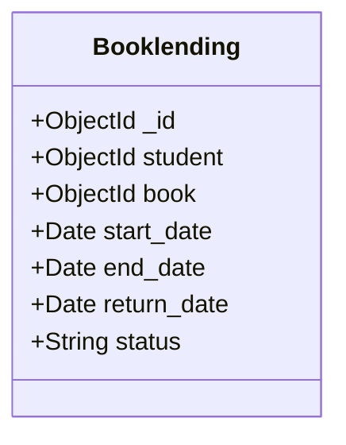

# 📋 Spec Template — Spec-Driven Development (SDD)

> **Template di Specifica Funzionale e Tecnica per lo sviluppo assistito da Agenti AI**  
> *Ingegneria del Software — DISI, Università degli Studi di Trento*

Questo documento costituisce la **Fonte di Verità (*Single Source of Truth*)** per ogni nuova feature o modifica al sistema. Deve essere redatto e validato **prima** di richiedere all'agente AI la generazione del codice di produzione.

---

## 📌 1. Metadati della Feature

- **ID Feature / User Story**: `[es. US-09 / FEAT-RETURN-BOOK]`
- **Titolo Feature**: `[es. Registrazione Restituzione Libro da parte del Bibliotecario]`
- **Autore / Studente**: `[Nome e Cognome / Matricola / Gruppo]`
- **Sprint di Riferimento**: `[es. Sprint 2]`
- **Data di Redazione Specifica**: `[AAAA-MM-GG]`
- **Stato Specifica**: `[ ] DRAFT | [ ] IN REVIEW | [x] APPROVED`

---

## 🎯 2. Requisiti & User Story

### 2.1 Formulazione della User Story
```text
Come [Ruolo Utente: es. Bibliotecario / Studente / Admin],
Voglio [Azione o funzionalità desiderata],
Per [Valore di business o beneficio atteso].
```

### 2.2 Criteri di Accettazione (Formato Gherkin / Given-When-Then)

```gherkin
Scenario: [Nome Scenario 1 - Percorso Ideale / Happy Path]
  Given [Stato iniziale del sistema / Pre-condizioni]
    And [Eventuale stato autenticato o risorsa esistente]
  When [Azione compiuta dall'utente o chiamata API]
  Then [Risultato atteso sul sistema]
    And [Codice di stato HTTP e struttura della risposta]
    And [Effetto collaterale / Mutazione dello stato del database]

Scenario: [Nome Scenario 2 - Caso Errore / Edge Case / Validazione]
  Given [Pre-condizione non valida o stato conflittuale]
  When [Tentativo di eseguire l'azione]
  Then [Codice di stato HTTP di errore (es. 400, 404, 409)]
    And [Messaggio di errore strutturato restituito]
    And [Nessuna modifica non autorizzata nel database]
```

---

## 📐 3. Modello Dati & Schemi di Dominio

Descrivere le entità coinvolte, le modifiche allo schema del database (es. Mongoose) e le relazioni.

### 3.1 Diagramma Entità / Relazioni (Mermaid)


### 3.2 Specifiche di Validazione dei Campi
| Campo | Tipo | Obbligatorio? | Vincoli / Regole di Validazione | Valore di Default |
|---|---|:---:|---|---|
| `field_name` | `String` / `Number` / `ObjectId` | Sì/No | [es. min length, regex email, enum valori ammessi] | `null` |

---

## 🌐 4. Contratto API (OpenAPI 3.0 / REST Contract)

Definire esattamente l'interfaccia dell'endpoint da implementare/estendere (da riportare in `oas3.yaml`).

### 4.1 Dettagli Endpoint
- **Metodo HTTP**: `[GET / POST / PUT / PATCH / DELETE]`
- **Path**: `/api/v1/...`
- **Autenticazione**: `[Nessuna / Bearer JWT (tokenChecker)]`
- **Ruoli ammessi**: `[Tutti / Studente Proprietario / Bibliotecario / Admin]`

### 4.2 Specifica OAS3 (Estratto YAML)
```yaml
paths:
  /api/v1/resource/{id}/action:
    post:
      summary: "[Descrizione sintetica]"
      parameters:
        - name: id
          in: path
          required: true
          schema:
            type: string
      requestBody:
        required: true
        content:
          application/json:
            schema:
              type: object
              required:
                - exampleField
              properties:
                exampleField:
                  type: string
      responses:
        '200':
          description: Operazione completata con successo
          content:
            application/json:
              schema:
                $ref: '#/components/schemas/ResourceResponse'
        '400':
          description: Dati di input non validi
        '404':
          description: Risorsa non trovata
        '409':
          description: Conflitto di stato (es. risorsa già processata)
```

---

## 🔒 5. Invarianti di Business e Sicurezza

Elenco non ambiguo delle regole di consistenza che l'agente AI **NON deve violare**:

1. **Invariante 1 (Integrità Dati)**: *[es. "Una copia di un libro non può avere più di un prestito attivo contemporaneamente."]*
2. **Invariante 2 (Autorizzazione)**: *[es. "Uno studente può consultare e cancellare solo i propri prestiti, mai quelli di altri studenti."]*
3. **Invariante 3 (Transazionalità / Idempotenza)**: *[es. "Se la restituzione fallisce a metà, lo stato del prestito deve rimanere invariato (rollback)."]*

---

## 🧪 6. Specifiche dei Test (Test-Driven Specification)

I test devono essere progettati per verificare la conformità alla specifica sopra descritta.

### 6.1 Casi di Test di Unità / Controller (`app/tests/*.test.js`)
- [ ] **TC-01 (Happy Path)**: Verifica successo con payload valido $\to$ HTTP 200/201 e stato DB coerente.
- [ ] **TC-02 (Missing Auth)**: Chiamata senza token $\to$ HTTP 401 Unauthorized.
- [ ] **TC-03 (Invalid Input)**: Chiamata con parametri mancanti o malformati $\to$ HTTP 400 Bad Request.
- [ ] **TC-04 (Not Found)**: Chiamata su ID inesistente $\to$ HTTP 404 Not Found.
- [ ] **TC-05 (Business Conflict)**: Chiamata che viola l'invariante di business $\to$ HTTP 409 Conflict.

---

## 🤖 7. Istruzioni per l'Agente AI (Prompting Guide)

Incollare questo blocco nel prompt dell'agente AI per guidare l'implementazione:

```markdown
### 🎯 CONTESTO & OBIETTIVO
Stai implementando la feature definita nella specifica: "[Titolo Feature]" (ID: [ID Feature]).

### 📄 SPECIFICHE VINCOLANTI
- Rispetta fedelmente il contratto OpenAPI definito nella sezione 4.
- Rispetta il modello dati e le validazioni descritte nella sezione 3.
- Rispetta rigorosamente le invarianti di business descritte nella sezione 5.
- Implementa o aggiorna prima i test automatici descritti nella sezione 6 in `app/tests/[feature].test.js`.

### 🛑 VINCOLI NON FUNZIONALI
- Stack: Node.js 22 (ES Modules), Express 5, Mongoose 8, Jest + Supertest.
- Non introdurre dipendenze non autorizzate nel `package.json`.
- Non rimuovere controlli di sicurezza o middleware di autenticazione.

### 🔄 WORKFLOW RICHIESTO
1. Proponi prima un Piano di Implementazione dettagliato (`implementation_plan.md`).
2. Attendi l'approvazione umana del piano.
3. Implementa i test (fallimento iniziale).
4. Implementa il codice applicativo (rotte, controller, modelli).
5. Esegui la suite `npm test` e verifica che tutti i test passino senza regressioni.
```

---

## ✅ 8. Checklist di Revisione Umana (*Human-in-the-Loop Gate*)

Prima di eseguire il merge della Pull Request, lo studente deve verificare:

- [ ] I test automatici coprono tutti i criteri di accettazione Gherkin?
- [ ] I contratti API in `oas3.yaml` corrispondono esattamente all'implementazione?
- [ ] L'agente ha introdotto codice non necessario, ridondante o vulnerabile?
- [ ] La pipeline CI di GitHub Actions è completamente verde?
- [ ] La documentazione Swagger UI `/api-docs` è navigabile e aggiornata?
