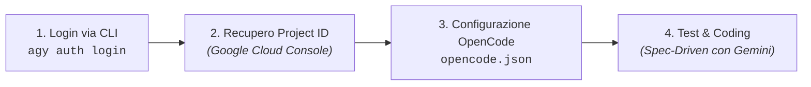

# ☁️ Guida al Setup: OpenCode + Google Cloud (Vertex AI)

> **Guida alla Configurazione dell'Ambiente di Sviluppo con Crediti Studente (50$)**  
> *Ingegneria del Software — DISI, Università degli Studi di Trento*

Questa guida illustra come configurare **OpenCode** (e gli agenti di sviluppo) utilizzando i modelli **Google Gemini su Vertex AI** tramite i **50$ di credito Google Cloud** assegnati a ciascuno studente.

---

## 💡 Perché il Login via CLI (Senza API Key)?

Nelle organizzazioni universitarie con Google Workspace (es. `@unitn.it`), la creazione manuale di **API Key** è spesso disabilitata per policy di sicurezza centralizzate.  
Utilizzando il **login OAuth via CLI (Antigravity CLI o Google Cloud SDK)**:
- Non serve alcuna API Key hardcoded.
- Le credenziali vengono salvate in modo sicuro come *Application Default Credentials (ADC)*.
- **OpenCode** riconosce ed eredita automaticamente queste credenziali per invocare Vertex AI scalando dai 50$ di credito.

---

## 🚀 Setup Passo-Passo (in 4 Step)



---

### Step 1: Autenticazione OAuth tramite CLI

Apri il terminale del tuo computer ed esegui il login:

#### Opzione A: Tramite Antigravity CLI (Consigliata)
```bash
agy auth login
```
*(Si aprirà una finestra del browser: seleziona il tuo account Google/UniTN associato al progetto con i crediti di 50$ e concedi l'accesso).*

#### Opzione B: Tramite Google Cloud SDK (Alternativa standard)
Se hai installato `gcloud`:
```bash
gcloud auth application-default login
```

Una volta completato il login, le credenziali OAuth locali saranno disponibili per tutti i tool di sviluppo.

---

### Step 2: Recuperare il proprio `PROJECT_ID` su Google Cloud

1. Accedi alla [Google Cloud Console](https://console.cloud.google.com/).
2. In alto a sinistra (accanto al logo Google Cloud), apri il menu a discesa dei progetti.
3. Seleziona il progetto su cui è attivo il coupon di 50$.
4. Copia il valore del campo **ID Progetto** (es. `easylib-student-123456`).

> ⚠️ **Verifica API Vertex AI**: Nella barra di ricerca della Google Cloud Console, cerca **"Vertex AI API"** e assicurati che sia nello stato **Abilitata** (*Enabled*).

---

### Step 3: Configurare OpenCode

All'interno del progetto EasyLib o nella configurazione globale di OpenCode, crea/aggiorna il file di configurazione (es. `opencode.json` o nelle impostazioni dell'estensione):

```json
{
  "$schema": "https://opencode.ai/config.json",
  "provider": "google-vertex",
  "vertexAI": {
    "project": "<IL-TUO-PROJECT-ID>",
    "location": "europe-west1"
  },
  "models": {
    "default": "gemini-2.5-flash",
    "planner": "gemini-2.5-pro",
    "coder": "gemini-2.5-flash"
  },
  "options": {
    "temperature": 0.2
  },
  "rulesFiles": [
    "AGENTS.md"
  ]
}
```

> Sostituisci `<IL-TUO-PROJECT-ID>` con il tuo vero ID Progetto recuperato allo Step 2.

---

### Step 4: Verifica del Funzionamento

1. Apri **OpenCode** nel tuo editor (VS Code o terminale).
2. Invia un messaggio di test all'agente:
   > *"Quali entità sono definite nel file AGENTS.md e nel file oas3.yaml?"*
3. Se l'agente risponde analizzando i file, il collegamento con Vertex AI è attivo e funzionante!

---

## 🧠 Best Practice: Ottimizzare l'Uso dei 50$ di Credito

I modelli Gemini hanno costi per milione di token molto contenuti; con 50$ si possono effettuare **decine di milioni di token**, più che sufficienti per l'intero corso se usati con metodo:

| Modello | Quando usarlo | Perché |
|---|---|---|
| **`gemini-2.5-flash`** / **`gemini-1.5-flash`** | **90% del tempo**: implementazione codice, generazione test Jest, correzione bug, review rapida. | Estremamente veloce, consuma frazioni minime di centesimo per richiesta. |
| **`gemini-2.5-pro`** / **`gemini-1.5-pro`** | **10% del tempo**: stesura della specifica iniziale ([`SPEC_TEMPLATE.md`](file:///Users/marcorobol/Develop/IS/EasyLib/SPEC_TEMPLATE.md)) e piani architetturali complessi (`implementation_plan.md`). | Massima capacità di ragionamento e comprensione del contesto globale. |

---

## 📊 Monitorare il Credito Residuo (Consigli Utili)

1. **Controllare la Fatturazione**:
   - Vai su [Google Cloud Billing](https://console.cloud.google.com/billing) per verificare il consumo giornaliero e il credito rimanente.
2. **Impostare un Alert di Budget (Consigliato)**:
   - Nella sezione *Billing > Budgets & Alerts*, crea un alert impostato su **40$** per ricevere un'email di avviso prima dell'esaurimento dei crediti.
3. **Evitare il Vibe Coding**:
   - Fornire prompt mirati basati su specifiche (come da [`docs/PROMPT_CHEATSHEET.md`](file:///Users/marcorobol/Develop/IS/EasyLib/docs/PROMPT_CHEATSHEET.md)) riduce drasticamente i round-trip inutili e il consumo di token.

---

## ❓ Domande Frequenti (FAQ & Troubleshooting)

### D: Ricevo l'errore `PermissionDenied: 403 Vertex AI API has not been used in project...`
- **Soluzione**: Accedi alla Google Cloud Console con il tuo account, cerca **"Vertex AI API"** e clicca su **"Abilita"** (*Enable*).

### D: Ricevo l'errore `DefaultCredentialsError: Could not automatically determine credentials`
- **Soluzione**: Riesegui `agy auth login` o `gcloud auth application-default login` nel terminale e verifica che il browser confermi il salvataggio del token.

### D: Devo committare il mio `PROJECT_ID` su Git?
- **Risposta**: Il `PROJECT_ID` di Google Cloud non è un secret, ma se preferisci puoi configurarlo nelle impostazioni globali dell'IDE o in una variabile d'ambiente (`export CLOUD_ML_PROJECT_ID=...`) senza versionarlo nel repository.
