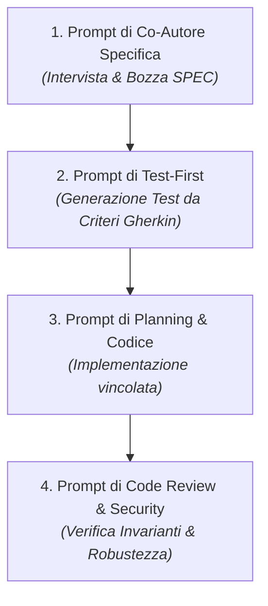

# 💡 Prompt Cheatsheet: Spec-Driven Development con Agenti AI

> **Guida Operativa ai Prompt per gli Studenti**  
> *Ingegneria del Software — DISI, Università degli Studi di Trento*

Questa guida fornisce **modelli di prompt pronti all'uso** per interagire in modo efficace con gli agenti AI (**OpenCode**, Antigravity IDE, Cursor, Claude Code, GitHub Copilot) durante ciascuna fase del ciclo **Spec-Driven Development**.  
*Per la configurazione di OpenCode con crediti Google Cloud (50$), consulta la guida: [`OPENCODE_GCP_SETUP.md`](OPENCODE_GCP_SETUP.md).*

---

## 🧭 Mappa del Ciclo dei Prompt



---

## 📝 Fase 1: Co-Autore della Specifica (Spec-Assisted Generation)

*Obiettivo: Usare l'AI per non partire da zero nella scrittura di [`SPEC_TEMPLATE.md`](file:///Users/marcorobol/Develop/IS/EasyLib/SPEC_TEMPLATE.md).*

### 📋 Prompt 1.1 — "Intervistami per chiarire i requisiti"
```text
Voglio creare una nuova feature per EasyLib: "[Descrizione informale della feature, es. consentire la proroga di un prestito di 15 giorni]".
Agisci come Senior Software Architect. Non generare ancora codice né test.
Fammi da 3 a 5 domande mirate per chiarire:
1. Requisiti funzionali ed edge cases.
2. Invarianti di business e regole di consistenza.
3. Permessi e ruoli di autorizzazione.
Attendi le mie risposte prima di procedere.
```

### 📋 Prompt 1.2 — "Genera la bozza di Specifica e l'estratto OpenAPI"
```text
Sulla base delle risposte concordate, compila una bozza completa della specifica per EasyLib seguendo rigorosamente la struttura del file `SPEC_TEMPLATE.md`.
Includi:
- User Story in formato standard.
- Criteri di accettazione in formato Gherkin (almeno 1 Happy Path e 3 casi di errore/edge case).
- Estratto YAML compatibile con OpenAPI 3.0 per `oas3.yaml` (con parametri, request body e codici di risposta 200/201/204, 400, 401, 404, 409).
- Elenco delle invarianti di business non negoziabili.
```

> ⚠️ **Nota per lo Studente**: Leggi, correggi e valida personalmente la specifica prima di salvarla in `specs/US-XX.md`. Tu sei l'architetto responsabile.

---

## 🧪 Fase 2: Test-First Generation

*Obiettivo: Generare la suite di test Jest + Supertest a partire dalla specifica approvata.*

### 📋 Prompt 2.1 — "Genera la suite di test di fallimento (Red Stage)"
```text
Leggi la specifica approvata nel file `specs/[nome-specifica].md` e i contratti in `oas3.yaml`.
Genera i test automatici Jest e Supertest nel file `app/[modulo].test.js` che coprano tutti i casi definiti nella sezione "Specifiche dei Test" e nei criteri Gherkin:
- Happy Path (successo).
- Parametri mancanti o non validi (HTTP 400).
- Token mancante o non autorizzato (HTTP 401 / 403).
- Risorse non trovate (HTTP 404).
- Violazione delle invarianti di business (HTTP 409).

Non implementare ancora la logica di business; i test devono inizialmente fallire (Red Stage).
```

---

## 💻 Fase 3: Planning & Implementazione Vincolata

*Obiettivo: Guidare l'agente a pianificare prima di modificare il codice applicativo.*

### 📋 Prompt 3.1 — "Proponi il Piano di Implementazione"
```text
Leggi la specifica in `specs/[nome-specifica].md` e i test che falliscono in `app/[modulo].test.js`.
Prima di scrivere qualsiasi riga di codice applicativo, proponi un Piano di Implementazione dettagliato (`implementation_plan.md`):
- Elenca i file da creare o modificare (es. modelli Mongoose, middleware, controller, route).
- Spiega brevemente le modifiche architetturali.
- Elenca i comandi di verifica.
Attendi la mia approvazione prima di modificare i sorgenti.
```

### 📋 Prompt 3.2 — "Implementa e fai passare tutti i test (Green Stage)"
```text
Il piano è approvato. Procedi con l'implementazione del codice per la feature.
Vincoli inderogabili:
- Stack: Node.js 22 ESM (`import/export`), Express 5, Mongoose 8.
- Rispetta le invarianti descritte nella specifica.
- Non modificare i contratti definiti in `oas3.yaml` né allentare le asserzioni nei test.
- Esegui `npm test` al termine e assicurati che tutta la suite di test del progetto sia al 100% verde.
```

---

## 🔍 Fase 4: Code Review, Security & Refactoring

*Obiettivo: Verificare che l'agente non abbia introdotto codice superfluo, insicuro o allucinato.*

### 📋 Prompt 4.1 — "Audit di Sicurezza e Controllo Invarianti"
```text
Effettua una revisione critica del codice appena scritto in `app/[modulo].js`:
1. Ci sono falle di sicurezza (es. Injection, bypass di `tokenChecker`, esposizione di dati sensibili)?
2. Le invarianti di business definite nella specifica sono protette sia a livello di validazione schema che di controller?
3. C'è codice morto, dipendenze non necessarie o complessità superflua?
4. I codici di errore HTTP e i messaggi JSON corrispondono perfettamente a quanto documentato in `oas3.yaml`?
Riporta eventuali criticità identificate con le relative correzioni.
```

### 📋 Prompt 4.2 — "Sincronizzazione Documentazione OpenAPI & UI"
```text
Verifica che tutte le rotte, i parametri e le risposte implementate nel controller siano registrate correttamente in `oas3.yaml`.
Se ci sono discrepanze, aggiorna `oas3.yaml` in modo che la documentazione interattiva `/api-docs` sia completa ed esaustiva.
```
