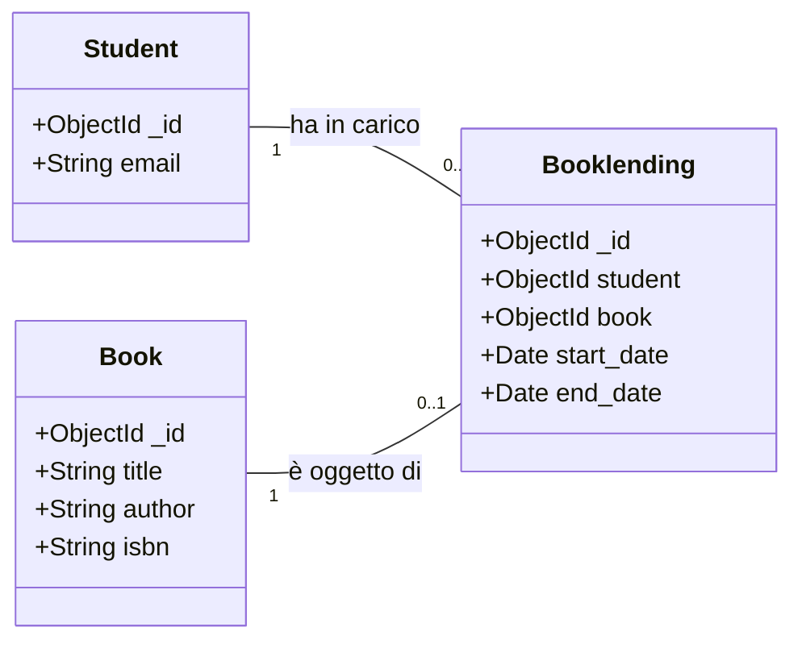

# 📋 Spec: US-07 — Registrazione Restituzione Libro

> **Esempio "Gold Standard" di Specifica per la Metodologia Spec-Driven Development (SDD)**  
> *Progetto EasyLib — Ingegneria del Software (DISI, Università degli Studi di Trento)*

Questo documento funge da **fonte di verità (*Single Source of Truth*)** per l'implementazione della User Story **US-07**.

---

## 📌 1. Metadati della Feature

- **ID Feature / User Story**: `US-07 / FEAT-RETURN-BOOK`
- **Titolo Feature**: Registrazione Restituzione Libro e Chiusura Prestito
- **Autore / Ruolo**: Team EasyLib (Esempio Didattico)
- **Sprint di Riferimento**: Sprint 1
- **Data di Redazione Specifica**: 2026-09-10
- **Stato Specifica**: `[x] APPROVED`

---

## 🎯 2. Requisiti & User Story

### 2.1 Formulazione della User Story
```text
Come bibliotecario o studente autenticato,
Voglio registrare la restituzione di un libro preso in prestito (cancellando/chiudendo il prestito attivo),
Per rendere il libro nuovamente disponibile nel catalogo per altri studenti.
```

### 2.2 Criteri di Accettazione (Formato Gherkin / Given-When-Then)

```gherkin
Scenario: Restituzione con successo di un prestito attivo (Happy Path)
  Given uno studente autenticato con token JWT valido
    And un prestito esistente nel database associato a tale studente per un libro "Book A"
  When il client invia una richiesta DELETE a /api/v1/booklendings/{id} con token valido
  Then il server risponde con status code 204 No Content
    And il record del prestito non è più presente tra i prestiti attivi nel database
    And il libro "Book A" risulta nuovamente disponibile per nuovi prestiti

Scenario: Tentativo di restituzione senza autenticazione (Missing Token)
  Given un prestito esistente nel database con ID valido
  When il client invia una richiesta DELETE a /api/v1/booklendings/{id} senza header o query token
  Then il server risponde con status code 401 Unauthorized
    And il corpo della risposta contiene { "error": "No token provided" }
    And lo stato del prestito nel database rimane inalterato

Scenario: Tentativo di cancellazione di un prestito inesistente (Not Found)
  Given uno studente autenticato con token JWT valido
    And un ID di prestito che non corrisponde ad alcun documento nel database
  When il client invia una richiesta DELETE a /api/v1/booklendings/{id} con token valido
  Then il server risponde con status code 404 Not Found
    And il corpo della risposta contiene { "error": "Booklending not found" }

Scenario: ID prestito non valido / malformato (Bad Request)
  Given uno studente autenticato con token JWT valido
    And una stringa ID non valida come ObjectId MongoDB (es. "abc-123")
  When il client invia una richiesta DELETE a /api/v1/booklendings/abc-123
  Then il server risponde con status code 400 Bad Request
```

---

## 📐 3. Modello Dati & Schemi di Dominio

La restituzione opera sull'entità `Booklending` e ripristina la disponibilità logica del `Book`.

### 3.1 Diagramma Entità / Relazioni (Mermaid)



### 3.2 Specifiche di Validazione
| Parametro | Tipo | In | Obbligatorio? | Vincoli |
|---|---|---|:---:|---|
| `id` | `ObjectId (hex string 24 chars)` | Path | ✅ Sì | Deve essere un ObjectId MongoDB valido ed esistente nella collezione `booklendings`. |
| `x-access-token` o `?token=` | `JWT String` | Header/Query | ✅ Sì | Token valido emesso per lo studente o bibliotecario. |

---

## 🌐 4. Contratto API (OpenAPI 3.0)

Estratto corrispondente da integrare/verificare in [`oas3.yaml`](file:///Users/marcorobol/Develop/IS/EasyLib/oas3.yaml):

```yaml
paths:
  /api/v1/booklendings/{id}:
    delete:
      tags:
        - booklendings
      summary: Registra la restituzione di un libro e cancella il prestito attivo
      parameters:
        - name: id
          in: path
          description: ID univoco del prestito da cancellare
          required: true
          schema:
            type: string
            example: "60c72b2f9b1d8b2badbee123"
      responses:
        '204':
          description: Prestito cancellato con successo, libro restituito
        '400':
          description: ID prestito malformato o non valido
          content:
            application/json:
              schema:
                $ref: '#/components/schemas/ErrorResponse'
        '401':
          description: Autenticazione richiesta / Token mancante o non valido
          content:
            application/json:
              schema:
                $ref: '#/components/schemas/ErrorResponse'
        '404':
          description: Prestito non trovato
          content:
            application/json:
              schema:
                $ref: '#/components/schemas/ErrorResponse'
```

---

## 🔒 5. Invarianti di Business e Sicurezza

1. **Invariante 1 (Idempotenza di rilascio)**: La cancellazione di un prestito deve rendere immediatamente il libro associato disponibile per una nuova richiesta di prestito (`POST /api/v1/booklendings`).
2. **Invariante 2 (Protezione Accesso)**: Nessuna cancellazione può avvenire in modalità anonima; il middleware `tokenChecker` deve intercettare e bloccare le richieste non autenticate con HTTP 401.
3. **Invariante 3 (Integrità Referenziale)**: La cancellazione del prestito non deve alterare o cancellare il record dello Studente né quello del Libro nel catalogo.

---

## 🧪 6. Specifiche dei Test (Test-Driven Specification)

I test automatici in `app/booklendings.test.js` devono coprire:

- [ ] **TC-01 (Happy Path)**: `DELETE /api/v1/booklendings/:id` con token valido ed ID esistente $\to$ HTTP 204.
- [ ] **TC-02 (Missing Auth)**: `DELETE /api/v1/booklendings/:id` senza token $\to$ HTTP 401.
- [ ] **TC-03 (Not Found)**: `DELETE /api/v1/booklendings/:nonExistentId` $\to$ HTTP 404.
- [ ] **TC-04 (Invalid ObjectId)**: `DELETE /api/v1/booklendings/invalid-hex` $\to$ HTTP 400.
- [ ] **TC-05 (Re-borrow Book)**: Subito dopo la restituzione con successo, una successiva `POST /api/v1/booklendings` per lo stesso libro deve avere successo (HTTP 201).

---

## 🤖 7. Prompting Guide per l'Agente AI

```markdown
### 🎯 CONTESTO & OBIETTIVO
Devi implementare l'endpoint `DELETE /api/v1/booklendings/:id` seguendo la specifica `specs/US-07-return-book.md`.

### 📄 SPECIFICHE VINCOLANTI
- Contratto OpenAPI definito in `oas3.yaml` (sezione `/api/v1/booklendings/{id}`).
- Middleware `tokenChecker` applicato alla route.
- Rispetta le invarianti della sezione 5 e i casi di test della sezione 6.

### 🔄 ISTRUZIONI DI ESECUZIONE
1. Genera o aggiorna prima i test in `app/booklendings.test.js` per i casi TC-01..TC-05 (verificare che falliscano).
2. Implementa il controller/route in `app/booklendings.js`.
3. Esegui `npm test` e assicurati che tutta la suite sia al 100% verde senza regressioni.
```

---

## ✅ 8. Checklist di Revisione Umana (*Human Gate*)

- [ ] I casi di test TC-01..TC-05 sono stati implementati ed eseguiti con successo?
- [ ] Il middleware di autenticazione `tokenChecker` è attivo sulla rotta DELETE?
- [ ] La risposta HTTP 204 non invia body (standard RFC 9110)?
- [ ] La documentazione Swagger in `/api-docs` riflette accuratamente la cancellazione?
